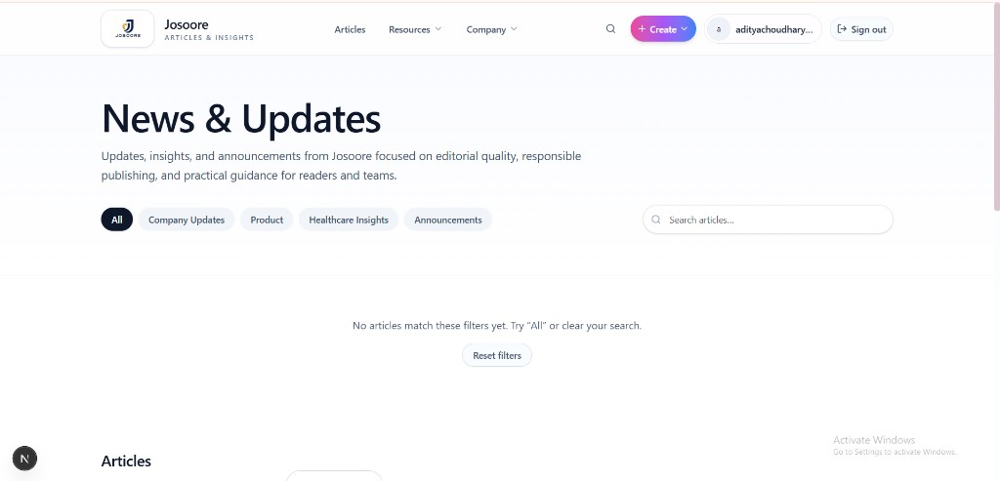
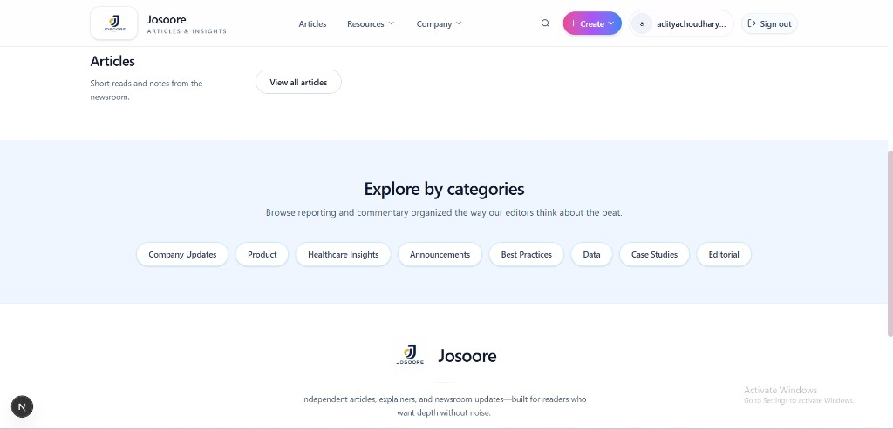
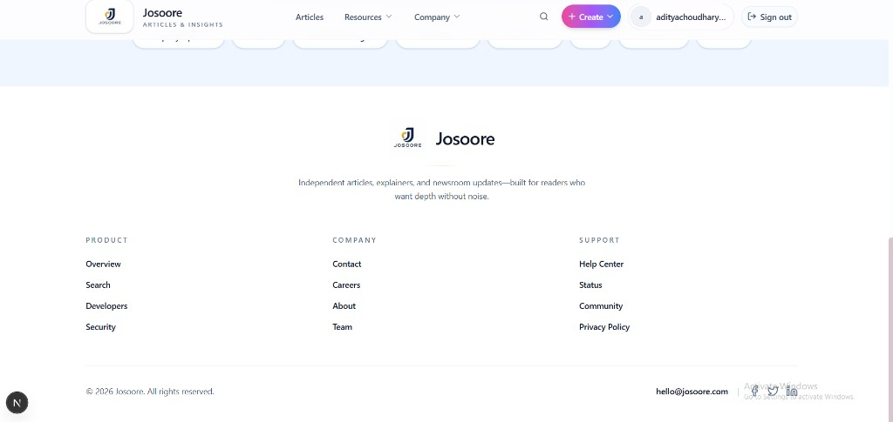
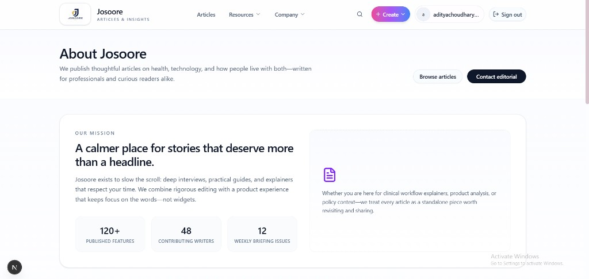

# Josoore

Article-focused publishing experience built with Next.js: news hub, categories, editorial pages, and a cohesive light UI.

## UI screenshots

Images are stored in-repo under [`docs/ui-screenshots/`](docs/ui-screenshots/) so they render on GitHub when you view this README.

### Home — News and updates



### Articles, explore by categories, and footer



### Footer — Product, Company, Support



### About



## Development

```bash
pnpm install
pnpm dev
```

Open [http://localhost:3000](http://localhost:3000).
